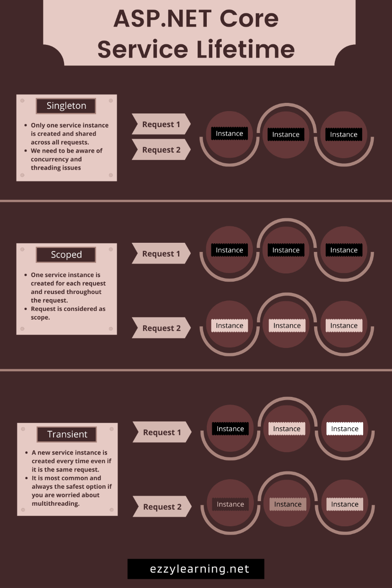

Ref: https://www.ezzylearning.net/tutorial/asp-net-core-service-lifetimes-infographic

I came across this really nice illustration of how the different service lifetimes work in asp.net core (singleton/scoped/transient):

