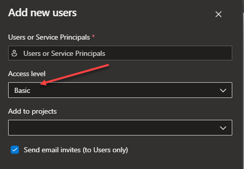
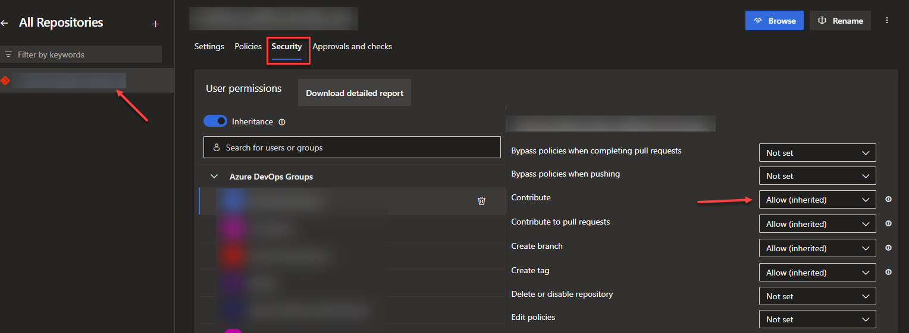
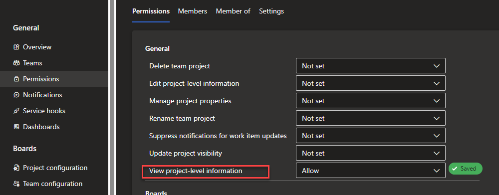

At work we came across a need to grant a single user access to only a single repository in Azure DevOps. \
Here's a short guide on how to achieve that with absolute minimal access.

### Add the user to the organization

If the user does not exist in the organization already they need to be added:

- In Azure DevOps - go to: Organization settings
- Users
- Add users
- Access level: Basic (this is required for access to Git Repositories)

### Granting access to the git repository

Then proceed to the Azure DevOps project where the git repository resides:

- Go to: Project settings
- Repos: Repositories
- Select/click the relevant repository
- Go to the Security tab
- Search for the user and grant/allow the relevant permissions (e.g. Read and/or Contribute)

### Project level access

The user will also need access to `View project-level information` to be able to clone the repository:

- Go to: Project settings
- General: Permissions
- Create a new Group and add the user to this group
- Click the group and in the Permissions tab grant/allow the following: View project-level information

