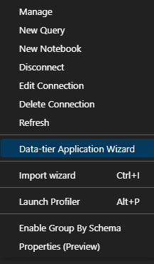

Sometimes it's useful to be able to work or debug real data locally. Here's a simple howto for exporting an Azure SQL database to your local SQL Server instance.

## Requirements

A really quick and simple way to export the database from Azure to your local machine is to use `Azure Data Studio` with the `Admin Pack for SQL Server` extension installed.

You can install Azure Data Studio with `winget`:

```bash
winget install Microsoft.AzureDataStudio
```

Then go to Extensions. search for `Admin Pack for SQL Server` and install it.

Once installed, restart Azure Data Studio.

## Exporting the database to a bacpac file

Connect to your Azure SQL Server instance using Azure Data Studio.

Right click the `Databases` section and then select `Data-tier Application Wizard`:


Proceed by selecting `Export the schema and data from a database to the logical .bacpac file format [Export Bacpac]`:


Click Next and select the server, database and the file location for the `bacpac` file:


Click Next to see the summary and then Export.


The export will start and you will see the progress in Tasks:


## Importing the bacpac file to your local SQL Server instance

Run the following SQL query on your local SQL master database:

```sql
sp_configure 'contained database authentication', 1; 
GO  
RECONFIGURE;
GO
```

Then right click the `Databases` section and select `Data-tier Application Wizard`:



Proceed by selecting `Create a database from a .bacpac file [Import Bacpac]`:


Choose the `.bacpac` file, the server and the database name:


Review the summary and click Import:


An import task will start and once completed you will see the succeeded message in Tasks:

