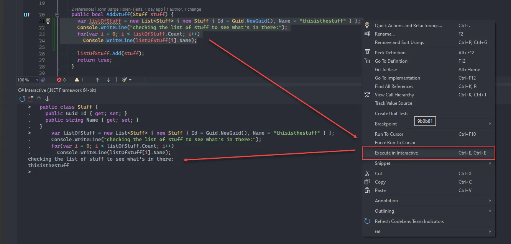

So, turns out there is an option for sending code directly from the Visual Studio text editor to the `C# interactive window` for execution.

You can mark the code you want to send and press `CTRL+E` twice to execute it. This all allows you to quickly run/check any code you're working on without having to spin up the whole app and can potentially give you a bit of a productivity boost.

A limitation is that the C# interactive window does not have any knowledge/context awareness about your code though, so it will only know about whatever you have executed in that window previously. If you want to execute some code that uses a specific type, then you need to execute the definition of that type first (as you can see I've done with the "Stuff" class in the screenshot):

I ignorantly thought you could only write code directly in the window which is quite tedious, but this makes a much better experience.