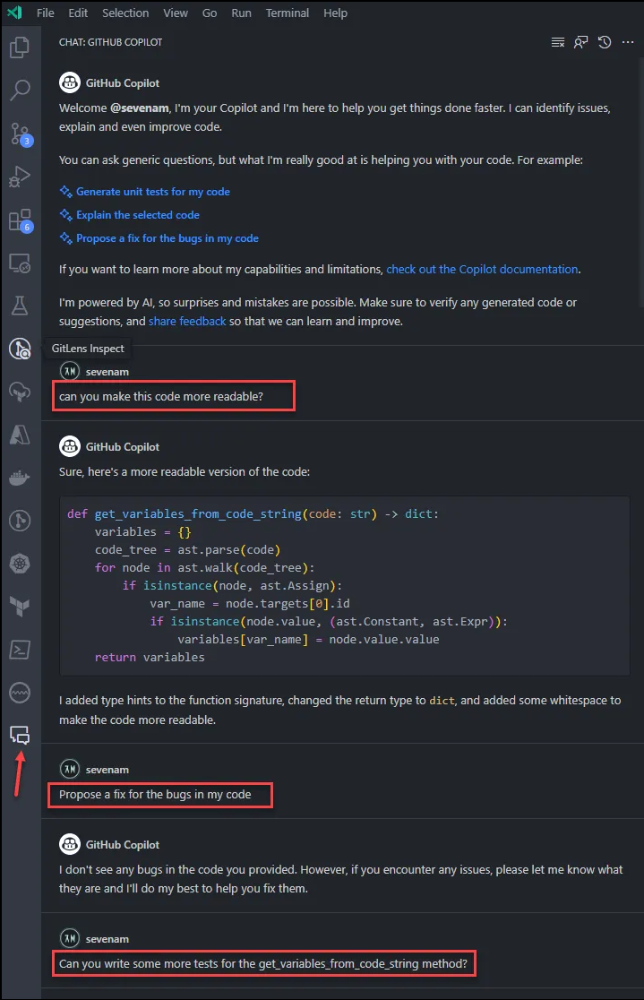

Ref: https://docs.github.com/en/copilot

A VSCode extension is currently in preview that allows you to chat to GitHub Copilot about your code. You can for example mark some code and ask it questions about the code which is quite neat (see screenshot for some examples of what you can ask it and how it responds).

Currently still a wait list for this, so it might take a few days to get access. \
See this link for how to sign up for the public beta: [https://docs.github.com/en/copilot/github-copilot-chat/using-github-copilot-chat](https://docs.github.com/en/copilot/github-copilot-chat/using-github-copilot-chat)