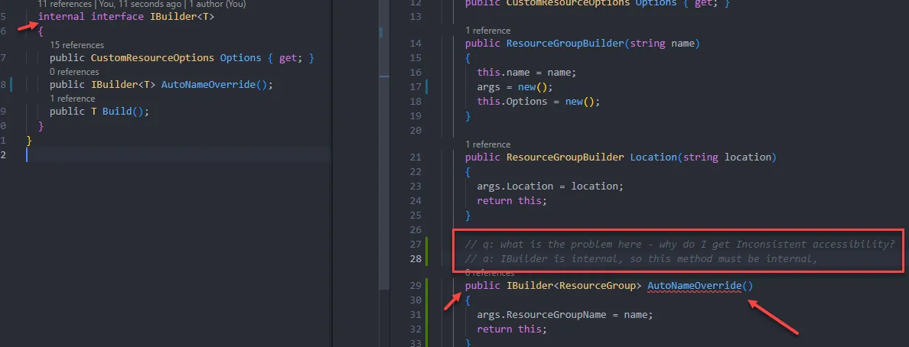

I've been using GitHub Copilot for a couple of months now (more or less only as an advanced auto-complete). \
However, I came across an interesting blog post yesterday that showed me it can do more than that.

You can actually just talk to it and ask it questions. The code you're working on is in its context, so it'll be able to "reason" about that if you ask it code related questions.
In the example below, I'm asking it about a compilation error and it lets me know exactly what the problem is. Obviously it's not always spot on to this degree and sometimes you have to re-formulate the question a few times before it gives you any useful response.

If you're feeling lonely, you can even talk to it about anything, but probably not with as good results as when you're talking about the code. \
Here's how it responded to non-code related question I asked it:

The interesting bit is that it just responds with a link, which is probably part of the data it was trained on (so it's sort of revealing it's secrets a bit).

> Ref: https://dagshub.com/blog/github-copilot-not-code/