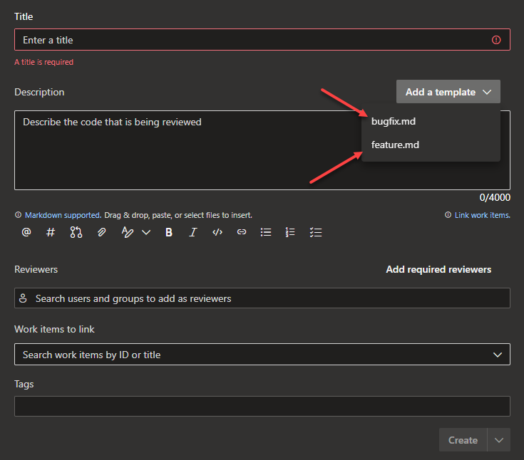

Here's a guide on how to set up GitVersion in Azure DevOps to automatically work out the Semantic Version of the commit being built by leveraging your git history.

## Requirements

There are a few requirements that needs to be in place first before you can start using GitVersion.

First off you need do an unshallow clone of your git repository. In your pipeline you can do that like this:

```yaml
# do a self checkout for GitVersion to work
- checkout: self
  fetchDepth: 0
```

Secondly, your repository needs a `main` or `master` branch. If using GitFlow you also need a `develop` branch.

Finally you probably want a tag (such as: 0.1.0.0) on your `main` branch that GitVersion can base its versioning on.

You can read more about the requirements here: https://github.com/GitTools/actions/blob/main/docs/examples/azure/gitversion/execute/usage-examples.md

## Installing the GitTools extension in Azure DevOps

If you have access to install the [GitTools extension](https://marketplace.visualstudio.com/items?itemName=gittools.gittools) in Azure DevOps, that would be the easiest way to get started.

Once installed you can install it in your pipeline with the gitversion/setup task:

```yaml
- task: gitversion/setup@0
  displayName: Install GitVersion
  inputs:
    versionSpec: '5.x'
    preferLatestVersion: true
```

And then execute it with the gitversion/execute task like this:

```yaml
- task: gitversion/execute@0
  displayName: 'Determine version with GitVersion'
  inputs: 
    useConfigFile: true
    configFilePath: './GitVersion.yml'
```

This execution depends on the configuration being specified in the `GitVersion.yml` file directly in the root of the repository. In the configuration file you can specify your branching strategy. In the example below the strategy is to use a "main" branch and branching out "feature" and "bugfix" branches from that one while adding specific tags to them.

```yaml
mode: Mainline
branches:
  main:
    is-mainline: true
    is-source-branch-for: ['feature', 'bugfix']
  feature:
    regex: ^feature?[/-]
    source-branches: ['main']
    tag: feat-{BranchName}
  bugfix:
    regex: ^bugfix?[/-]
    source-branches: ['main']
    tag: bugfix-{BranchName}
ignore:
    sha: []
merge-message-formats: {}
   
```

To see what options GitVersion gives you, this script can be helpful for displaying it's variables:

```yaml
# See this link for more examples: https://github.com/GitTools/actions/blob/main/docs/examples/azure/gitversion/execute/usage-examples.md
- script: |
    echo "Major: $(GitVersion.major)"
    echo "Minor: $(GitVersion.minor)"
    echo "Patch: $(GitVersion.patch)"
    echo "PreReleaseTag: $(GitVersion.preReleaseTag)"
    echo "PreReleaseTagWithDash: $(GitVersion.preReleaseTagWithDash)"
    echo "PreReleaseLabel: $(GitVersion.preReleaseLabel)"
    echo "PreReleaseNumber: $(GitVersion.preReleaseNumber)"
    echo "WeightedPreReleaseNumber: $(GitVersion.weightedPreReleaseNumber)"
    echo "BuildMetaData: $(GitVersion.buildMetaData)"
    echo "BuildMetaDataPadded: $(GitVersion.buildMetaDataPadded)"
    echo "FullBuildMetaData: $(GitVersion.fullBuildMetaData)"
    echo "MajorMinorPatch: $(GitVersion.majorMinorPatch)"
    echo "SemVer: $(GitVersion.semVer)"
    echo "LegacySemVer: $(GitVersion.legacySemVer)"
    echo "LegacySemVerPadded: $(GitVersion.legacySemVerPadded)"
    echo "AssemblySemVer: $(GitVersion.assemblySemVer)"
    echo "AssemblySemFileVer: $(GitVersion.assemblySemFileVer)"
    echo "FullSemVer: $(GitVersion.fullSemVer)"
    echo "InformationalGitVersion: $(GitVersion.informationalGitVersion)"
    echo "BranchName: $(GitVersion.branchName)"
    echo "EscapedBranchName: $(GitVersion.escapedBranchName)"
    echo "Sha: $(GitVersion.sha)"
    echo "ShortSha: $(GitVersion.shortSha)"
    echo "NuGetGitVersionV2: $(GitVersion.nuGetGitVersionV2)"
    echo "NuGetGitVersion: $(GitVersion.nuGetGitVersion)"
    echo "NuGetPreReleaseTagV2: $(GitVersion.nuGetPreReleaseTagV2)"
    echo "NuGetPreReleaseTag: $(GitVersion.nuGetPreReleaseTag)"
    echo "GitVersionSourceSha: $(GitVersion.GitVersionSourceSha)"
    echo "CommitsSinceGitVersionSource: $(GitVersion.commitsSinceGitVersionSource)"
    echo "CommitsSinceGitVersionSourcePadded: $(GitVersion.commitsSinceGitVersionSourcePadded)"
    echo "UncommittedChanges: $(GitVersion.uncommittedChanges)"
    echo "CommitDate: $(GitVersion.commitDate)"
  displayName: 'Print GitVersion variables'
```

## Updating your pipeline to match your version tag

You probably also want to update the build number of your pipeline run to match your semantic version from GitVersion:

```yaml
- task: Bash@3
  displayName: Update pipeline build number
  inputs:
    targetType: inline
    script: echo "##vso[build.updatebuildnumber]$(GitVersion.SemVer)"
```

## Including the build/pre-release number in your version

If you want to also include the daily build counter/pre-release number in your version you can do that like this:

```yaml
# create a variable to store the version number in:
variables: 
  version: ''

# combine the MajorMinorPatch and PreReleaseNumber variables to get a version number like "0.1.0.14"
- script: "echo ##vso[task.setvariable variable=version]$(GitVersion.MajorMinorPatch).$(GitVersion.PreReleaseNumber)"
  displayName: 'Set version number'  
```

## Printing out the version numbers in the pipeline

For debugging purposes it might be useful to print your generated version numbers in the pipeline:

```yaml
- script: |
    echo Current version number $(version)
  displayName: 'Print asm file version'  

- script: echo Current semantic version is $(GitVersion.SemVer)
  displayName: 'Print semantic version'
```

## Injecting the build number into your .NET builds

Dotnet build and publish allows you to inject the version number into your projects/solutions by using the `/p` argument.

```yaml
- script: dotnet restore ./YourSolution.sln
  displayName: 'Dotnet restore'
- script: dotnet build --configuration $(debugBuild) /p:Version=$(version) ./YourSolution.sln
  displayName: 'Dotnet build $(debugBuild) for tests'
- script: dotnet build --configuration $(releaseBuild) /p:Version=$(version) ./YourSolution.sln
  displayName: 'Dotnet build $(releaseBuild)'
- script: dotnet publish ./YourProject.csproj --configuration $(releaseBuild) -r win-$(buildPlatform) /p:Version=$(version)
  displayName: 'Dotnet publish $(releaseBuild) win-$(buildPlatform)'
```

Ensure that you have not manually specified any version inr your .csproj file since that will take precedence over the /p argument:

```xml
<!-- this will override your /p argument: -->
<Version>1.0.0.0</Version>
<AssemblyVersion>1.0.0.0</AssemblyVersion>
<FileVersion>1.0.0.0</FileVersion>
```

## Using GitVersion without installing the Azure DevOps GitTools extension

You can also use GitVersion without installing the extension. With .NET you can install it with dotnet tool install:

```yaml
- script: 'dotnet tool install --global GitVersion.Tool --version 5.*'
  displayName: 'Dotnet install GitVersion.Tool'
```

Using the same configuration YAML file from above we can then run dotnet-gitversion to verify it's generating the output we expect it to:

```yaml
- script: 'dotnet-gitversion /config ./GitVersion.yml'
  displayName: 'Print GitVersion variables'
```

Finally we can assign the output to a variable so we can proceed to use it in our pipeline:

```yaml
- task: PowerShell@2
  displayName: 'Determine version with GitVersion'
  inputs:
    targetType: 'inline'
    script: |
      $output = dotnet-gitversion /config ./GitVersion.yml | ConvertFrom-Json
      $output.PSObject.Properties | ForEach-Object {
        echo "##vso[task.setvariable variable=GitVersion.$($_.Name)]$($_.Value)"
      }
```

## Setting up pull request templates

If you're using pull requests, you might want to set up templates to increase the minor version when merging your feature branches and the patch version when merging your bugfix pull requests.

To do this, create the following files in the root of your project using this folder structure:

```bash
.azuredevops/pull_request_template/branches/bugfix.md
.azuredevops/pull_request_template/branches/feature.md
```

The feature.md file could look like this to increase the minor version:

```md
Input details about the feature PR here

DO NOT REMOVE THIS LINE: [+semver:minor]
```

The bugfix.md file could look like this to increase the patch version:

```md
Input details about the bugfix PR here

DO NOT REMOVE THIS LINE: [+semver:patch]
```



Refs:
- https://gitversion.net/
- https://github.com/GitTools/GitVersion
