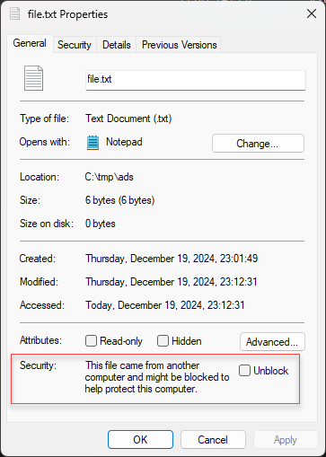
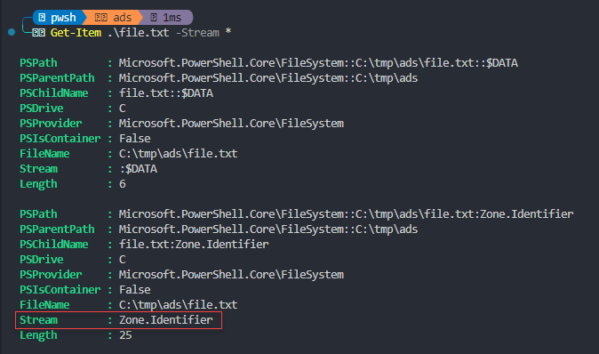

### NTFS and Alternate what?

*NTFS, the primary file system for recent versions of Windows and Windows Server, provides a full set of features including security descriptors, encryption, disk quotas, and rich metadata.* - as the [NTFS documentation](https://learn.microsoft.com/en-us/windows-server/storage/file-server/ntfs-overview) puts it. There's one thing the documentation does not mention however; the Alternate Data Streams (ADS). In fact I had to dig quite deep to find the [official documentation for NTFS Data Streams](https://learn.microsoft.com/en-us/openspecs/windows_protocols/ms-fscc/b134f29a-6278-4f3f-904f-5e58a713d2c5).

It turns out all files in NTFS are streams. That is, every file consist of at **least** one stream: the main stream. This the plain old file and it's content. The full name of the stream has the following form:

```ntfsstream
<filename>:<stream name>:<stream type>
```

As the default data stream has no name, this is how the stream name would look like for a regular `file.txt` where `$DATA` is the stream type:

```ntfsstream
file.txt::$DATA
```

### More streams

Note that a file consist of at least one stream, meaning it can actually contain more than just one. After downloading a file from the Internet you may have noticed the following after checking the properties of the file:



This is actually an `Alternate Data Stream` with the name `Zone.Identifier` that has been added to the file by the browser when you downloaded it from the Internet.

You can even add the Zone.Identifier ADS to a file yourself if you like. With Powershell you can do it like this:

```powershell
# in the example below we set the ZoneId to 3 which is 'Internet Zone'
# Ref: | 0 == Local Computer | 1 == Local Intranet Zone | 2 == Trusted Site Zone | 3 == Internet Zone | 4 == Restricted Site Zone
$filePath = ".\file.txt"
$zoneIdentifier = @"
[ZoneTransfer]
ZoneId=3
"@

Set-Content $filePath -Stream Zone.Identifier -Value $zoneIdentifier
```

If we open a cmd prompt and run `dir \r` we can see this very clearly:


We see the full name of the stream, with a filename, stream name and stream type:

```ntfsstream
<filename>:<stream name>:<stream type>

file.txt:Zone.Identifier:$DATA
```

With Powershell we can do something similar where we see it listing both the main data stream (:$DATA) and the alternate data stream Zone.Identifier:

```powershell
Get-Item .\file.txt -Stream * 

# or more similar to the dir /r command:
Get-ChildItem -Recurse | Get-Item -Stream * 
```



To have a look at the content of the file we can of course just open the file, or we can `cat .\file.txt` to print the content to the terminal. We can do something similar to look at the content of the Zone.Identifier stream, but we need to also specify the name of the stream in addition to the file name:

```powershell
cat .\file.txt:Zone.Identifier
```

Which gives the expected result:


If we want to programmatically remove the Zone.Identifier (which is what happens if we `Unblock` the file in explorer properties) we can do that with Powershell as well:

```powershell
Remove-Item .\file.txt -Stream Zone.Identifier

# or in previous versions of Powershell:
Remove-Item .\file.txt:Zone.Identifier
```

### Evil streams

So what if we take this one step further and not just put some text in the alternate data stream, but a whole file?

Let's make an evil.vbs script file with one line of code, that pops up a message box:

```vbs
MsgBox "Secretly doing evil stuff in here!", vbOKCancel, "Sneaky!"
```

And let's proceed to put this as an alternate data stream for the .\file.txt:

```powershell
cat .\evil.vbs > .\file.txt:evil.vbs

# and then let's just delete the vbs file so nobody will know
rm evil.vbs
```

Let's just check the alternate data streams for the file again:


It's added in there along with the Zone.Identifier we added earlier, fairly well hidden to the user as it's not visible in windows explorer. The size change is not visible either, since the main data stream is still the same size.

If we want to we can also execute the .vbs script with:

```powershell
wscript.exe .\file.txt:evil.vbs
```


Ref:
- https://learn.microsoft.com/en-us/windows-server/storage/file-server/ntfs-overview
- https://learn.microsoft.com/en-us/openspecs/windows_protocols/ms-fscc/b134f29a-6278-4f3f-904f-5e58a713d2c5
- https://owasp.org/www-community/attacks/Windows_alternate_data_stream