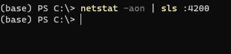
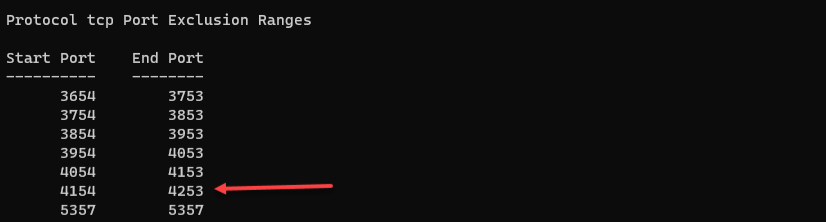
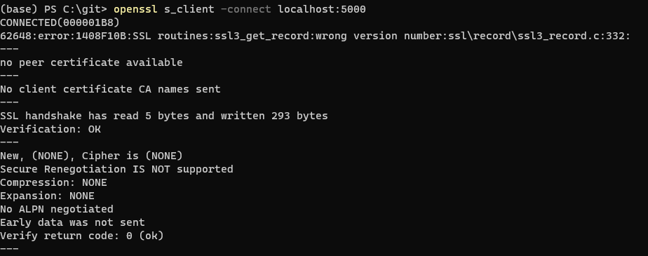

The other day I was having some port issues trying to spin up an app in debug. The app consists of 3 separate web services communicating with each other on different ports.

One of them failed to spin up because it said the port (4200) was already taken. \
However I could clearly see that the port was free with netstat and Select-String (sls):

```bash
netstat -aon | sls :4200
```



After some googling I found a stack overflow post that pointed me in the right direction. \
It suggested checking for excluded port ranges with netsh:

```bash
netsh interface ipv4 show excludedportrange protocol=tcp
```



...and there it was - in an excluded range. \
Why it was excluded I do not know, but rebooting my computer cleared the exclusion range.

So, then all 3 web services were up and running and I could verify that all 3 of them logged that they were listening on localhost on their respective ports. But everything was still not quite right. One of them was failing to respond properly on its port. Trying to call it with Insomnia (https://insomnia.rest) resulted in this error: `Error: SSL connect error`. The dev certificate for this project had expired 2 days ago and had been replaced without testing, so this sort of made sense. Something was probably wrong with the new dev certificate. I tried recreating the dev certificate a few times using the dotnet tool to replace and generate a new one:

```bash
dotnet dev-certs https --clean
dotnet dev-certs https --export-path .\localhost.pfx
dotnet dev-certs https --check
dotnet dev-certs https --trust
dotnet dev-certs https --check --trust
```

But this did nothing. Still the same issue. \
I went on to try debugging it with the openssl client:

```bash
 openssl s_client -connect localhost:5000
```

It responded that it `CONNECTED` but that the SSL version was wrong:
`62648:error:1408F10B:SSL routines:ssl3_get_record:wrong version number:ssl\record\ssl3_record.c:332:`



I tried the same thing but then specifying the tls version (trying 1.1, 1.2 and 1.3):

```bash
openssl s_client -connect localhost:5000 -tls1_3
```

All of them responded the same: wrong version number. \
I figured that it probably wasn't picking up the new dev certificate properly so I went looking in the appsettings.json. \
In the Kestrel settings things were looking OK:

```json
      "HttpsLocalhost": {
        "Url": "https://0.0.0.0:5000",
        "Certificate": {
          "Path": "localhost.pfx",
          "Password": ""
        }
      }
```

Listening on all interfaces (0.0.0.0) on port 5000.
At this point I didn't trust anything and changed the network address to 127.0.0.1 to try simplify things. \
Spinning it up again after the change I got an error: port already in use.

Did another netstat call and what do you know: `Intel Graphics Command Center Service` was listening on that port.
So it turned out I'd been trying to talk to that the whole time and since I was listening on all interfaces not just 127.0.0.1 I was not getting any errors when starting it up. Killed the service and then everything started up fine.

To prevent the intel service from taking the port again I could then exclude it manually by using the netsh tool again:

```bash
netsh int ipv4 add excludedportrange protocol=tcp startport=5000 numberofports=1

# and to delete the reservation again:
# netsh int ipv4 del excludedportrange protocol=tcp startport=5000 numberofports=1
```