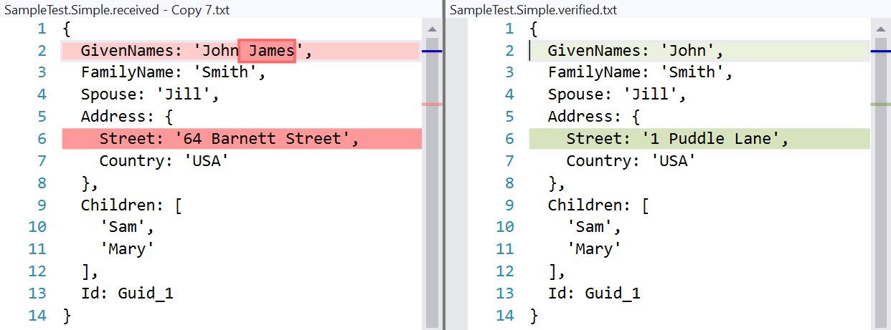

Ref: https://github.com/VerifyTests/Verify

I have used this in the past and it's pretty cool as you can compare complex data models, like JSON objects (it does serializing for you) during assert and you can ignore fields that doesn't matter. I think it even ignores fields that typically changes (like guid's) by default...

