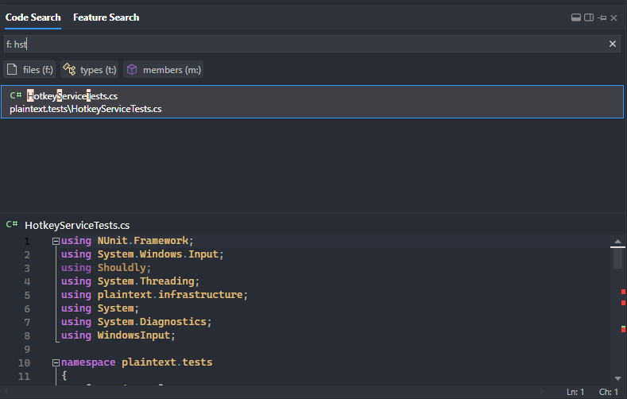
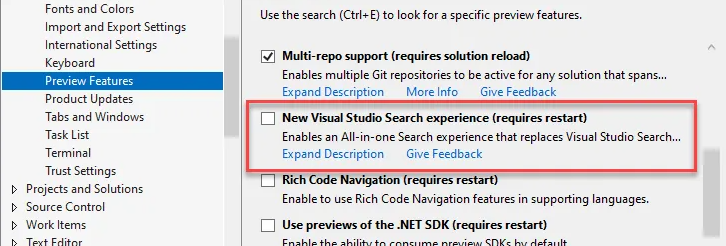

Learned a new trick this week for navigating code with the **New Visual Studio Search Experience** which currently is a preview feature in VS2022. \
I've used this for some time and it's quite a bit better than the old experience. It also includes code preview which is useful.

So, it turns out you can search for just the capital letters of a filename and it will find the files that matches for you. \
As shown in the image - I've done a file search for `hst` and it finds the file `HotkeyServiceTest` based on the PascalCase.

You can enable the new search experience under **Environment** => **Preview Features**:

