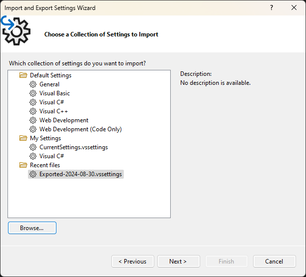

### Exporting the installation configuration

To export the installation configuration from your **old** Visual Studio installation, open the `Visual Studio Installer`, click `More` and choose `Export configuration:

Select a location for the config:

You get to select what to export. You can include/exclude here and click `Export`:

The installation configuration was successfully exported:

### Importing the installation configuration

To import the installation configuration into your **new** Visual Studio installation, open `Visual Studio Installer`, click `More` and choose `Import configuration:

Select the file you previously exported as the file to import:

Make any manual adjustments if needed and then click `Modify` to start the installation process:

### Exporting Visual Studio settings

Open your **old** Visual Studio instance and go to `Tools` and `Import and Export Settings...`

Select `Export selected environment settings` and click `Next`:

Choose the settings to export and click `Next`:

Name the export file, choose a location and press `Finish`:

Click `Close` when the export is completed:

### Importing Visual Studio settings

Open your **new** Visual Studio instance and go to `Tools` and `Import and Export Settings...`:

Select `Import selected environment settings`:

Save your existing configuration, or just import the new settings:

Click `Browse` to select the settings file you already exported and click `Next`:

Choose which settings to import and click `Finish`:

Once the import is complete you'll get a review. In my case some settings could not be imported and some manual changes had to be done as well:

### Keeping a backup

Generally it can be a good idea to keep a backup of settings like this.

A simple way would be to create a new git repo and commit the files there for safekeeping.
